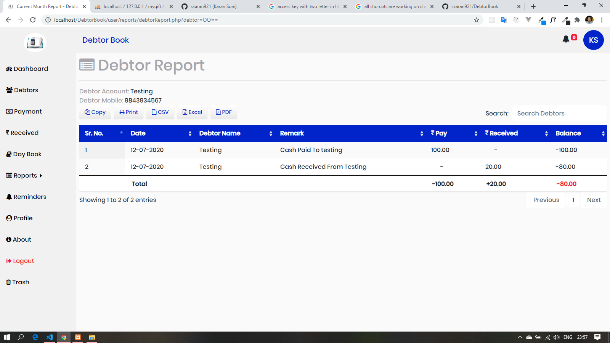
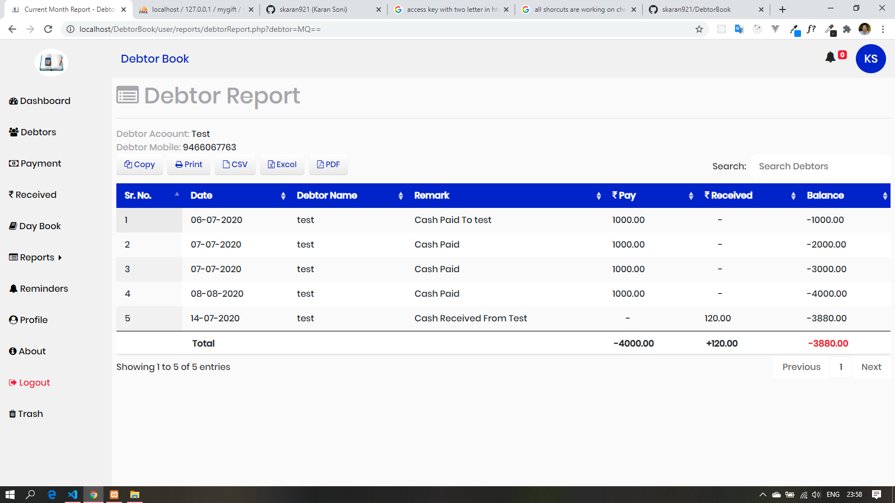
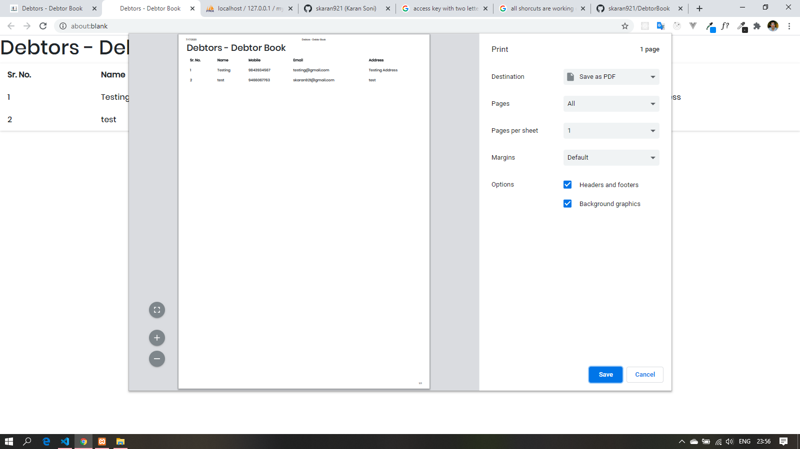
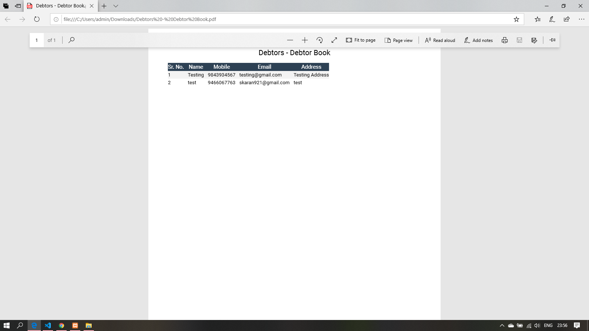
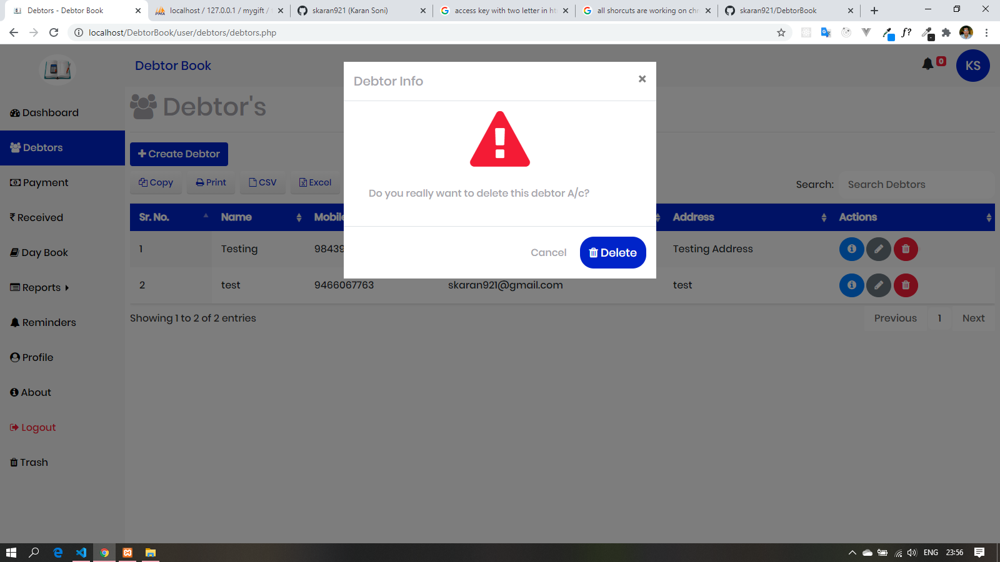
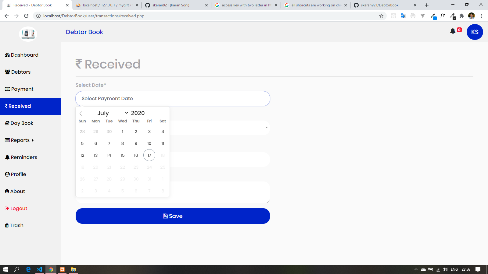
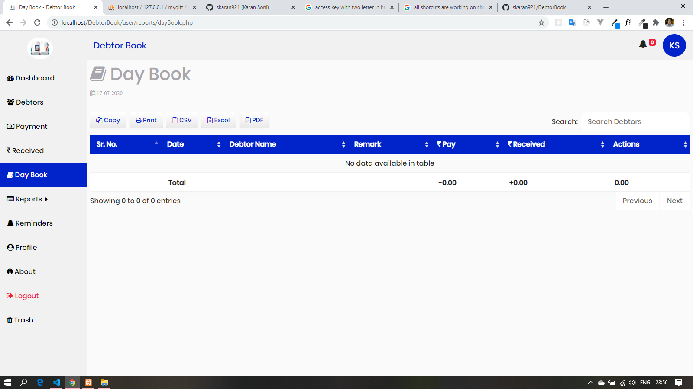
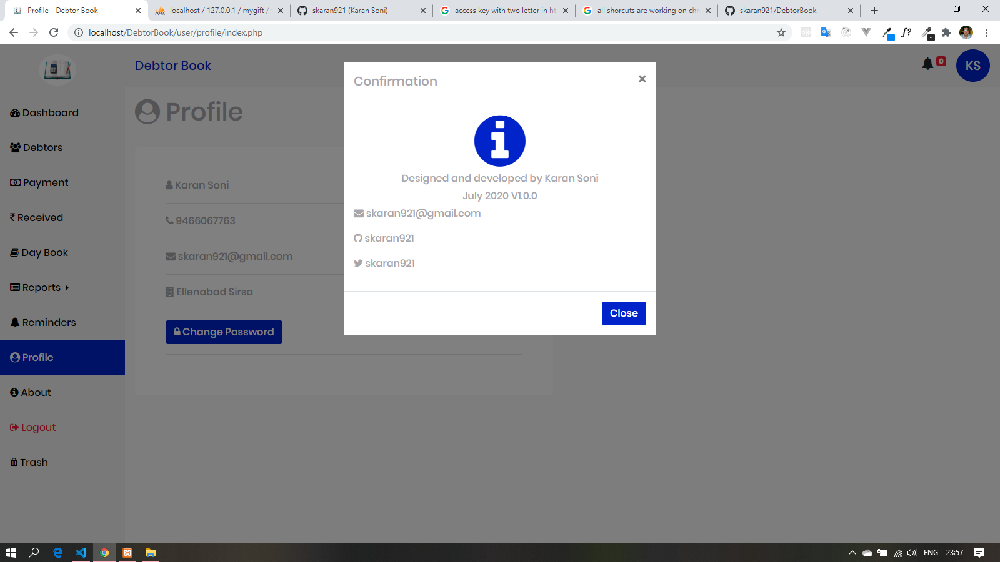
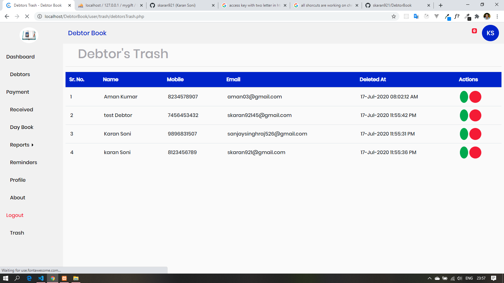
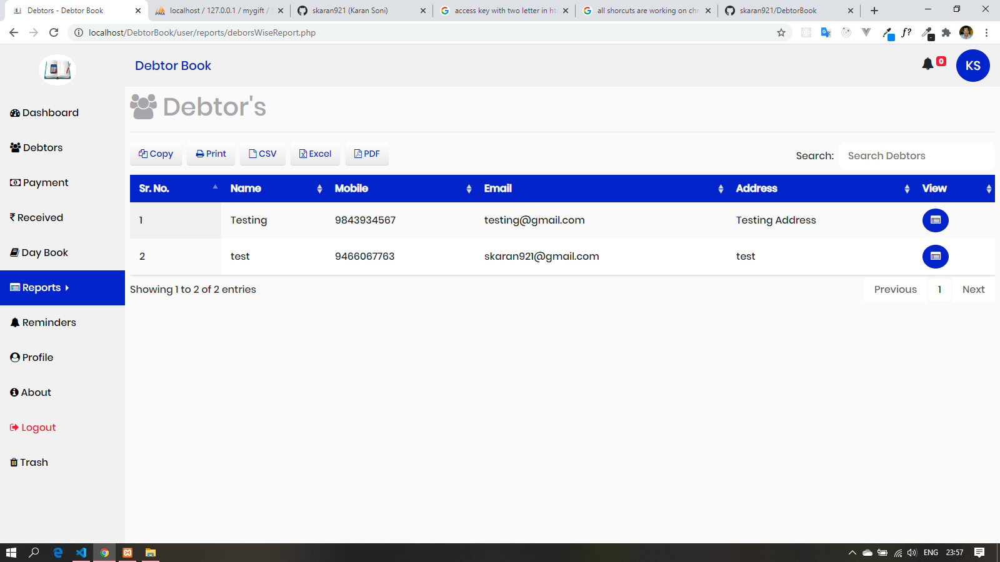

# DebtorBook
A PHP Application like Khata Book which keeps records of yours debotors.

# Instalation Step:
```
   Step1 : Download Project or clone this project
   Step2 : Move project to your Xamm/wampp/Lampp project directory
   Step3 : Got to dbStructure directory of this project and import project db into your Mysql Database using PhpMyAdmin, mysqlWorkBench or any other way as you like
   Step4 : Open your project in browser using your localserver for e.g. http://localhost/DebtorBook
   Step5 : Click on New User? 'Sign up' button
   Step6 : if you like the project so don't forgot to hit the start button and share this project as you can 
   Happy Coding!
```

<div> </div>
<div> </div>
<div> </div>
<div> </div>
<div> </div>
<div> </div>
<div> </div>
<div> </div>
<div> </div>
<div> </div>
<div> </div>
<div> </div>
<div> </div>
<div> </div>
<div> </div>
<div> </div>
<div> </div>
<div> </div>
<div> </div>
<div> </div>
<div> </div>
<div> </div>
<div> </div>
<div> </div>
<div> </div>

